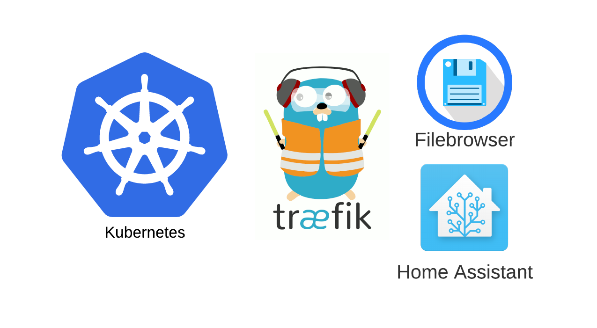

# Home Assistant Kubernetes Cluster

This repository contains a kubernetes cluster starter for a homeserver, and includes traefik ingress controllers for public and local access.

Included as default are the following containers:

* [Home Assistant](https://www.home-assistant.io/)
* [Filebrowser](https://github.com/filebrowser/filebrowser)

**Why Kubernetes?**

The purpose of this repository is theory!

## Quick Start

To deploy your cluster simply run copy `./kustomization.example.yaml` to `kustomization.yaml` and run `kubectl apply -k .`.

### Enabling Your App

By default your application will be deployment on three hosts:

* `homeassistant` - this will be the homeassistant installation
* `filebrowser` - the will be filebrowser installation
* `avalanche` -

Please add `your_cluster_ip homeassistant filebrowser avalanche` to your /etc/hosts file, or alternatively if your router supports dnsmaqs `address=/crepe/filebrowser/homeassistant/your_cluster_ip`, to access these services.

<!-- When trying to access home assistant for the first time you will receive a 400 Bad Request Response. This is because, [by default](https://www.home-assistant.io/integrations/http/) home assistant blocks access via proxies, so we'll need to modify the configuration.yaml to allow access to it. We can do this automatically by running the `sh ./scripts/enable_hass_ingress.sh` -->

## Advanced Usage

TODO: change me to patch instructions
### Setting up persistent storage for your pods

By default your pod will not persist data on termination. To do this, it is suggested you add a file in your `kustomization.yaml` underneath `patchStrategicMerge` to define a volume!

An example of setting up an NFS drive as a persistent can be found in [custom/examples/nfs-patch.yaml](./custom/examples/nfs-patch.yaml).

Read more about [kubernetes volume storage](https://kubernetes.io/docs/concepts/storage/) for information how to persist your data.

